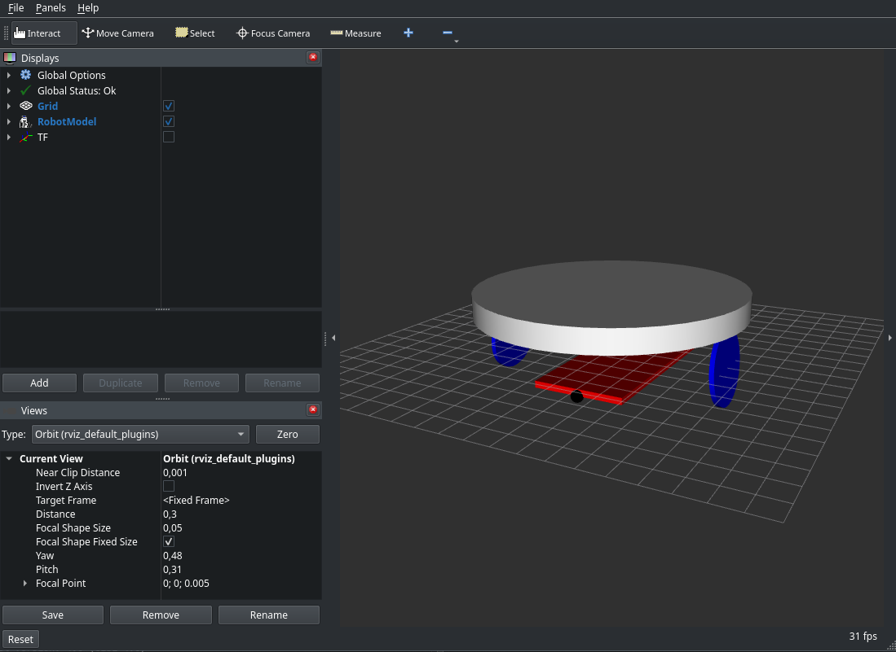

# ROS2 packages for Kabot project

In this repository you'll find robot bringup files `ros_control` stuff and urdf. Use [pixi](https://pixi.prefix.dev/latest/) for development.



## Quickstart:

Pixi uses `RMW_IMPLEMENTATION=rmw_zenoh_cpp`. Start a router in a separate
terminal with `pixi run ros2 run rmw_zenoh_cpp rmw_zenohd` before running ROS nodes.
For firmware telemetry, see [Native simulator telemetry](docs/native_sim.md).
For the physical robot, `pixi run native` defaults to empirical physical Twist
mapping; `rviz:=true` adds model visualization. See
[calibrated motion and the timed return loop](../docs/calibrated-motion.md).

Install [pixi](https://pixi.prefix.dev/latest/):
```bash
curl -fsSL https://pixi.sh/install.sh | sh
```
Clone the repo and cd into it:
```
git clone https://github.com/kabot-io/kabot_ros2.git
cd kabot_ros2
```

Build workspace:
```
pixi run build
```

Run simulation
```
pixi run sim
```

View the running controller in RViz (same router environment, no joint slider GUI):
```bash
pixi run view
```

This opens only RViz in the `odom` frame. Start one controller stack first;
the viewer uses its existing robot description and TF, without generating
joint states or starting another controller. See [controller view](kabot_robot/README.md#controller-view).

